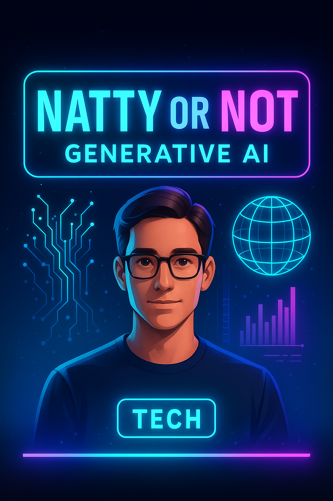

# 🧬 Natty or Not – A Verdade Sobre a IA Generativa

---

## 📘 Descrição

Este projeto foi desenvolvido como parte do desafio **#LabDIONattyOrNot** da DIO, explorando o potencial das IAs Generativas na criação de conteúdo multimídia.

A proposta é simples:
> **O que é natural ("Natty") e o que foi criado por IA?**

O objetivo é mostrar como diferentes ferramentas de IA podem transformar a maneira como produzimos **vídeos, áudios e imagens**, revelando até que ponto o resultado final pode parecer “natural”.

---

## 🤖 Tecnologias Utilizadas

- 🎥 **HeyGen** → Criação de vídeo com avatar e narração gerada por IA  
- 🎧 **ElevenLabs** → Produção do podcast com voz IA suave e natural  
- 🧠 **ChatGPT (OpenAI)** → Criação do roteiro, refinamento do texto e organização do projeto  
- 🖼️ **Gerador de Imagens IA** → Geração da thumbnail futurista oficial do projeto  

---

## 🧩 Processo de Criação

1. **Roteiro**  
   O texto foi estruturado com auxílio do ChatGPT, refinando narrativa e clareza.

2. **Vídeo (HeyGen)**  
   Avatar selecionado + narração IA + montagem automática com visual profissional.

3. **Podcast (ElevenLabs)**  
   Narração construída com voz IA natural, convertida em áudio MP3.

4. **Thumbnail Futurista**  
   Criada com IA usando estilo neon sci-fi para representar tecnologia e criatividade.

---

## 🚀 Resultados

### 🎬 Vídeo (HeyGen)  
🔗 https://drive.google.com/file/d/1x9Dy1ZlXtyStiuFxazxqCIyZ17dyrrBm/view?usp=sharing

### 🎧 Podcast (ElevenLabs)  
🔗 https://drive.google.com/file/d/1dSlDyRTNosylYqbYp0LyntZZEaxM8TYH/view?usp=sharing

### 🖼️ Thumbnail (IA)  
🔗 https://drive.google.com/file/d/1jdi22lbMPmaGgUC8V1oMADkFbW-1Rtj2/view?usp=sharing

---

## 🗂️ Arquitetura do Projeto

Natty-or-Not
│
├── 🎥 Video (HeyGen)
├── 🎧 Podcast (ElevenLabs)
├── 🖼️ Thumbnail Futurista (IA)
├── ✍️ Roteiro (ChatGPT)
└── 📄 README.md (Projeto Final)

---

## 🔥 Reflexão

Criar algo realista com IA é cada vez mais fácil.  
O desafio agora é aprender a **usar essas ferramentas com propósito**, explorando o melhor da automação sem perder o toque humano que dá autenticidade aos projetos.

---

# 📢 Compartilhe o Projeto!

Divulgue nas redes usando a hashtag:

🔥 **#LabDIONattyOrNot**

E marque também:

- **DIO** → https://www.linkedin.com/school/dio-makethechange  
- **falvojr** → https://www.linkedin.com/in/falvojr  

---

## 💡 Autor
**Claudio Menezes Santos**

---

